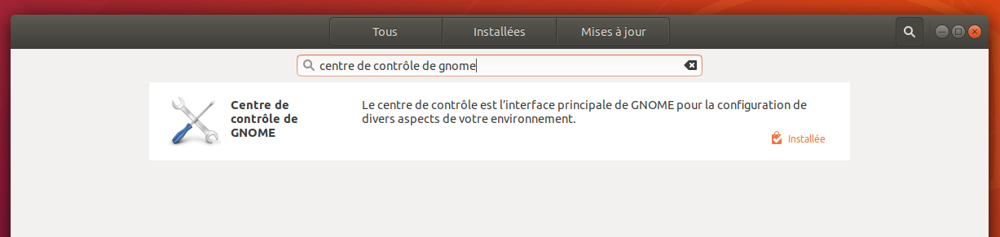

# Tutoriel : Installer le VPN d'Aquilenet dans l'interface graphique d'Ubuntu 18.04

[Aquilenet](https://www.aquilenet.fr/) est une association Bordelaise proposant du VPN ainsi que de l'hébergement et Internet libre à ses membres. Le VPN d'Aquilenet repose sur OpenVPN, voici un turoriel pour l'installer sur un Ubuntu 18.04 via l'interface graphique (pour installer en ligne de commande, voir les liens en bas de cette page).

Tutoriel fait en Juillet 2019.

## Préparation

Vous avez besoin de :
* Un ordinateur avec Ubuntu 18.04 LTS si possible à jour (ca devrait fonctionner sur des versions plus récentes mais sans garantie)
* Un fichier de configuration pour Ubuntu que vous pouvez télécharger [ici](https://raw.githubusercontent.com/Te-k/random/master/data/aquilenet-ubuntu.ovpn) et le certificat du serveur VPN téléchargeable [ici](https://atelier.aquilenet.fr/attachments/download/367/ca.crt) (ils doivent être dans le même dossier)
* Votre login et mot de passe VPN que vous pouvez trouver dans la [page adhérent](https://adherents.aquilenet.fr/vpn.php) dans l'onglet VPN

## Installer OpenVPN

Ubuntu possède un logiciel de gestion de VPN par défaut mais il n'inclus pas OpenVPN, il faut donc installer l'extension. Lancier "Logiciels Ubuntu",  cherchez "Centre de contrôle de GNOME".

Cliquez sur ce programme, allez en bas de la page et cherchez l'extension "OpenVPN" dans la liste des extensions.

Cochez la case de cette extension, et attendez que la mention "installée" soit affichée.

## Configurez OpenVPN

Lancez le programme "Paramètres" dans le menu des applications.

Allez dans l'onglet réseau, vous trouvez une partie VPN.

Cliquer sur l'icône "+", et sur "Importer depuis un fichier..."

Chercher le fichier `aquilenet-ubuntu.ovpn`. Si tout fonctionne bien, vous avez maintenant une page pour le VPN Aquilenet correctement configuré, il vous reste à rentrer votre login et mot de passe dans les champs correspondants.

Une fois validé, vous devez avoir un VPN Aquilenet dans votre liste :

## Testez

Vous pouvez maintenant lancer votre VPN directement depuis le menu d'Ubuntu en cliquant sur l'icône réseau et puis sur VPN > Se Connecter

Pour tester que vous utilisez bien le VPN d'Aquilenet, vous pouvez aller sur [ipinfo.io](https://ipinfo.io/) et confirmer que votre adresse IP publique appartient bien au réseau d'Aquilenet :

## Références

Si vous rencontrez des erreurs, vous pouvez consulter les pages suivantes :

* [Configuration de VPN sans brique](https://atelier.aquilenet.fr/projects/aquilenet/wiki/Configuration_VPN_sans_brique) par Aquilenet
* [La FAQ du VPN d'Aquilenet](https://www.aquilenet.fr/vpn/)

