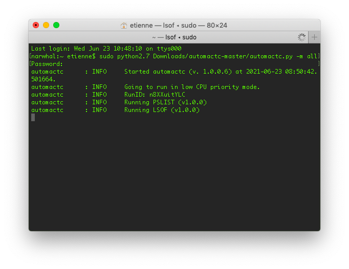
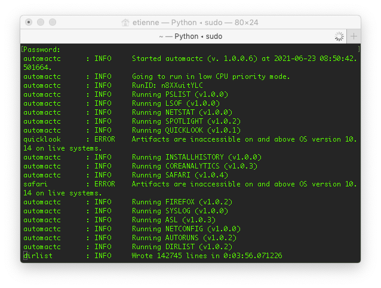
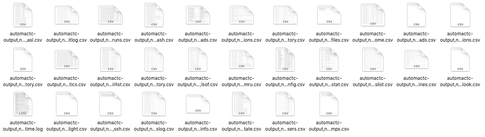
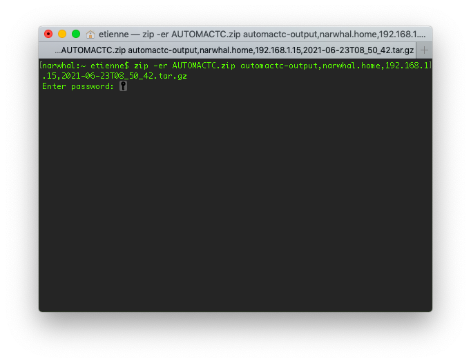

# How to run automactc on Mac OS

This guide aims at explaining how to run automactc on Mac OS in order to get forensic information from your system to share it with someone able to analyze it.

## Download and run automactc

You first need to download automactc from [this link](https://github.com/CrowdStrike/automactc/archive/refs/heads/master.zip) in your Download folder. You should have a file named `automactc-master.zip` in your Download folder. Double click on it to extract it.

Then go to the Launchpad and open the Terminal application. Type down `sudo python2.7 Downloads/automactc-master/automactc.py -m all` and press Enter. Enter your password when required (you won't see any star or letter in the terminal while typing your password)

Wait until the end of the program (it usually takes around 15 minutes, but it may take up to 30 minutes).

Once the program has finished running, you will find a file named `automactc-output,COMPUTER,USER,IP,DATE.tar.gz` in your home folder.

## Private informations

Most information gathered by automactc is technical system information (list of processes running, list of programs running on startups etc.), but it also includes your browser history (if you use Chrome, Safari or Firefox) and your cookies (if you use Chrome or Firefox). (You can see the full list of data gathered by the tool [here](https://github.com/CrowdStrike/automactc#current-modules))

Cookies can be used to impersonate you on online websites and a very precise profile of your habits can be determined through your browser history, so they are really sensitive.

This data can also be useful to identify if you were targeted by an attack (for instance if you clicked on a phishing link) so tt is up to you to decide if you are comfortable sharing this information with a third party. If you want to remove this information, here are the different steps to follow:
* Double click on the TAR file in order to extract it
* Delete the first automactc archive (`automactc-output....tar.gz`)
* Visit the folder created, its name starts with `automactc-output`

* Delete the files with the name finishing by `browser_chrome_history.csv`, `browser_cookies_chrome.csv`, `browser_cookies_firefox.csv`, `browser_firefox_history.csv`, `browser_safari_history.csv`
* Go back in your home. Right click on the automactc folder and click on "Compress"

You now have an automactc zip folder in your home, you can delete the automactc folder created above.

## Sharing the results

The file obtained at the end of the process contains data in clear text. It is recommended to share it through a secure sharing tool such as [OnionShare](https://onionshare.org/). If you prefer to share it through a less private file sharing platform (such as Google Drive, Dropbox or WeTransfer), it is strongly recommended to password protect this file. Sadly, there is no easy to use utility on Mac OS to do that, so we recommend creating a password protected archive using the zip command in the terminal.

Open a terminel in the launchpad (or continue in the one opened above), and type the following command  `zip -er AUTOMACTC.zip automactc-output[TAB]` (pressing tab at the end will automatically complete the file name, make sure that it is the .tar.gz or .zip file created above). Enter a secure password for this file twice.

You will then see a file `AUTOMACTC.zip` in your home folder that you can share securely.
